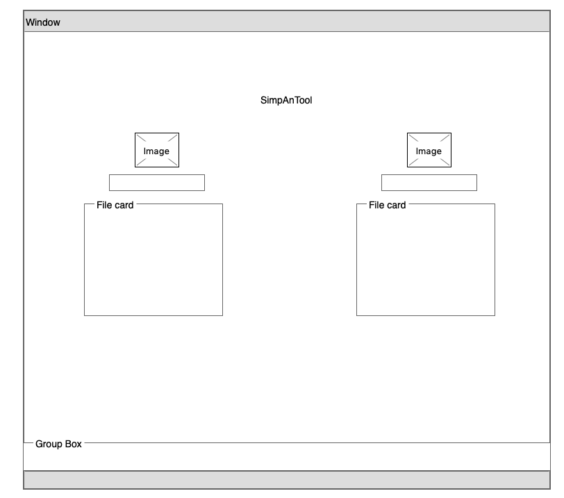

- PROJECT LIMBIK

SimpAnTool

Create a simple analysis tool to allow a user to search, examine and compare the data. 

First Phase - Backend:

1. Design and set Backend.

Second Phase - Frontend:

- Wireframe:

1. Design UX/UI.
2. Display data.
3. Search Filters.
4. Filter only for targeting process.(First Layer)

** User story:

- Search and filter files based on ID.
- Display data for single or multiple files.
- Search filter for targeting properties(First layer).

** Tools:

Client side:
React
Material-UI

Server Side:
Node.js

Set it up:

1. Open server-side and run npm i and npm start.
1. Open client-side and run npm i and npm start.

Search!!

